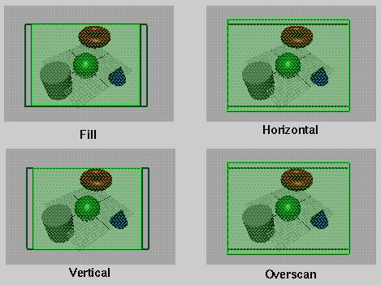

# Maya Camera Tools

Here is a collection of functions I've collected while working at Alias|wavefront back in the 90s.  These help with understanding how the Maya's camera parameters: film aperture, film offset, near clipping plane, focal length, camera scale, and film fit compute the camera viewing frustum.

The Maya camera model works using two "gates": the film gate and the resolution gate. The film gate is what the camera can see, and the resolution gate is what is rendered.  The maya camera model has a number of unique settings that no other software has.  It can be a challenge to match Maya's camera with other packages.

There are four options for film fit.   The green hatched area is the actual rendered area.   The green outline represents the camera's film gate.

## References

 * Maya 1.0 devkit
 * [Maya Python camera command](http://help.autodesk.com/cloudhelp/2017/ENU/Maya-Tech-Docs/CommandsPython/camera.html)
 * Maya Perspective Camera white paper by Chris Thorne.

